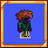

# Snek's Misc. Vanity

A collection of miscellaneous vanity items.

Content Summary:
* A set of items that allow the player to dye each part of their base player, including their skin, eyes, eye whites, and default clothing.
* A set of contacts which can force the player's eyes open, half-closed, or closed. They can also force the opposite and never let the player's eyes reach a state.
* A generic bracelet.

[Download the mod on Steam!](https://steamcommunity.com/sharedfiles/filedetails/?id=2887867341)

## Mod Calls

| Call | Description | Example
| --- | --- | --- |
| `"PlayerBodyDye", Player player, int slot : int` | Retrieves the dye that `player` is using for the given texture. Slot IDs are provided in `Terraria.ID.PlayerTextureID`. Note that some IDs may correspond to the same dye slot (for example, `Undershirt` and `ArmUndershirt`). | `DrawData data = /* ... */;` `data.shader = mod.Call("PlayerBodyDye", drawPlayer, PlayerTextureID.EyeWhites);` |