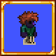

# Snek's Misc. Vanity

A collection of miscellaneous vanity items.

Content Summary:
* A set of items that allow the player to dye each part of their base player, including their skin, eyes, eye whites, and default clothing.
* A hair dye that takes on the effects of any dye used on it.
* A set of contacts which can force the player's eyes open, half-closed, or closed. They can also force the opposite and never let the player's eyes reach a state.
* A harness that allows you to hide your arms.
* A generic bracelet and a generic skirt.
* An eye patch that can be worn with hats.
* A Japanese umbrella. If you have the mod "Equipable Umbrellas" installed, you can equip this umbrella as well.
* A walking stick and a bowstaff, with both visual and functional appeal.
* Three DIY dyes, allowing you to combine any two dyes.
* A vanity accessory version of the Forbidden armor set's sigil that's dyed independently from the player's body armor.
* A special makeup kit that allows you to make mannequins look real.
* A bag you can put vanity accessories into to wear as many as you'd like.
* You can now use paints, hair dyes, and coatings as normal dyes.
* You can now wear some birds on your shoulders and hold some magic staves and tomes.
* Some swords now have sheaths.
* All vanilla quivers have been resprited and an equip spirte has been added for the Endless Quiver.

[Download the mod on Steam!](https://steamcommunity.com/sharedfiles/filedetails/?id=2887867341)

## Mod Calls

| Call | Description | Example
| --- | --- | --- |
| `"PlayerBodyDye", Player player, int slot : int` | Retrieves the dye that `player` is using for the given texture. Slot IDs are provided in `Terraria.ID.PlayerTextureID`. Note that some IDs may correspond to the same dye slot (for example, `Undershirt` and `ArmUndershirt`). | `DrawData data = /* ... */;` `data.shader = mod.Call("PlayerBodyDye", drawPlayer, PlayerTextureID.EyeWhites);` |
| `"GetConfigOption", string name : object` | Retrieves the value of the given config option. Valid names are any property in `SnekVanity.Common.ClientConfig`. If provided an invalid name, returns `null`. | `bool shouldHideMyModsTomes = (bool)mod.Call("GetConfigOption", "ShowTomesWhenHeld");` |